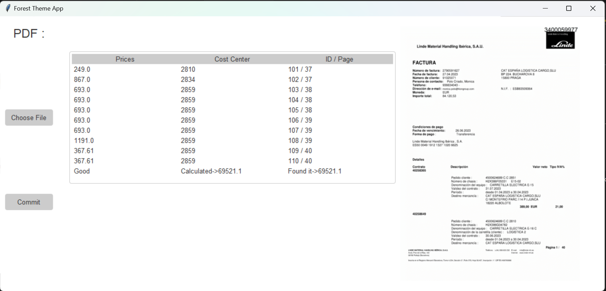

# Groupe Cat Python Data Manipulation

This is a Python project developed for data extraction and preprocessing, used by Groupe Cat, a company based in Spain.

## Project Overview
The project involves processing invoices and extracting relevant information, particularly related to users identified by their ID (chassis) and services.

## Usage
The project consists of Python scripts/modules for reading invoices and performing data manipulation tasks. It utilizes various libraries and tools for efficient processing.

## Features
- Reads invoices in various formats
- Extracts user information based on their ID (chassis)
- Manipulates data to retrieve service-related information
- Provides functionalities for data analysis and reporting

## Dependencies
The project relies on several Python libraries, including but not limited to:
- PIL (Python Imaging Library) for image processing
- PyPDF2 for PDF file manipulation
- openpyxl for Excel file processing
- Pandas for data manipulation and analysis

## Usage Instructions
1. Clone the repository to your local machine.
2. Install the required dependencies using pip:
3. Run the Python scripts/modules to perform data manipulation tasks.

## Usage example

## License
This project is licensed under the [MIT License](LICENSE).

